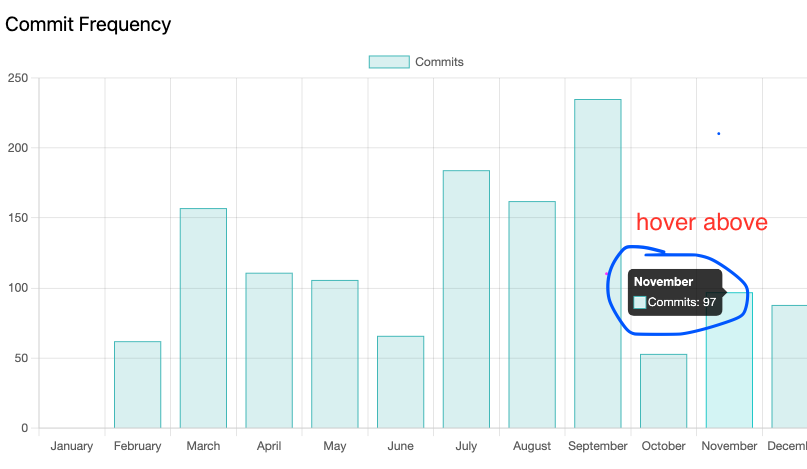

# 🚀 GitHub Insights Dashboard

[](https://jagoda11.github.io/github-insights-dashboard/)


[](https://github.com/Jagoda11/github-insights-dashboard/actions/workflows/update-from-main.yml)

## 📝 Summary

An interactive dashboard to visualize GitHub user activity, including commits, programming languages, and repository statistics.

- React ⚛️: For building user interfaces.
- Babel 🐵: Transpiling JavaScript.
- TypeScript 🔵: Type-safe coding.
- ESLint 🛠️: Linting and code quality.
- Prettier 🖋️: Code formatting.
- Jest 🃏: Testing framework.
- Husky 🐶: Git hooks for automation.
- GitHub Actions 🐢🐢: For CI/CD infrastructure.
- GitHub Pages 🐌: For easy and **free** deployment.

## Deployment

The web application is deployed on GitHub Pages and can be accessed at the following URL:

👉 [GitHub Insights Dashboard](https://jagoda11.github.io/github-insights-dashboard/)

GitHub Pages offers a **free** way to deploy static applications. Integration with GitHub allows for automatic updates with every push, making it a convenient option for hosting static sites. For more information, visit the [GitHub Pages documentation](https://docs.github.com/en/pages).

## Authentication with GitHub Personal Access Token (PAT)

This application requires authentication using a GitHub Personal Access Token (PAT).
For more details on how to set this up, check out this [article](https://medium.com/code-like-a-girl/the-quickest-way-to-authenticate-github-api-without-a-backend-4b230e85b652/).

## Features

### 1. **Dashboard Overview**

Provides an intuitive interface for navigating between charts and lists, giving users a comprehensive view of their GitHub data.


### 2. **Commit Frequency**

Displays a bar chart visualizing commits by month to help users analyze contribution trends.



### 3. **Commit List**

Lists all commits with details such as the author, message, and commit date, allowing users to filter and view specific activity.


### 4. **Programming Languages**

Shows a pie chart of the programming languages used across repositories, highlighting your most frequently used languages.


## 🚀 Initial Setup

To get started, clone the repository and install dependencies:

```bash
git clone https://github.com/Jagoda11/github-insights-dashboard.git
cd github-insights-dashboard
npm install --legacy-peer-deps
```

Start the development server:

```bash
   npm start
```

Your browser should navigate to:

```bash
   http://localhost:3002/github-insights-dashboard
```

## ⚠️ Note on Commits

If you're having trouble making a commit, it might be due to the `precommit` hook, which runs the `lint` and `test` scripts before each commit. If these scripts find any errors, the commit will be blocked. Check the output for any lint or test errors and fix them before trying to commit again.

## 📜 Scripts

To run these scripts, use `npm run <script-name>`:

- `start`: 🚀 Builds the TypeScript code and starts the application.
- `build`: 🔨 Compiles the TypeScript code using the TypeScript compiler (`tsc`).
- `test`: 🧪 Runs tests using Jest and generates a coverage report.
- `format`: 🖋️ Formats the code using Prettier.
- `lint`: 🧹 Lints all JavaScript and TypeScript files in the project using ESLint.
- `precommit`: 🔒 Runs the `lint` and `test` scripts before each commit to ensure code quality. This is managed by Husky 🐶.
- `pretest`: 🔍 Lints the code before running tests.
- `watch`: 👀 Runs tests in watch mode using Jest.
- `debug`: 🐞 Starts the application in debug mode using `nodemon`.
- `clean`: 🧽 Removes the `node_modules` directory and `package-lock.json` file.
- `prepare`: 🐾 Sets up Husky for managing git hooks.

## 🤖 GitHub Actions Workflows

This repo includes several GitHub Actions workflows that automate various tasks:

- `ci.yml`: Runs your project's continuous integration (CI) tasks.
- `close-merged-pull-requests.yml`: Automatically closes pull requests that have been merged.
- `close-stale-issues-and-prs.yml`: Closes stale issues and pull requests.
- `label-new-pull-requests.yml`: Automatically adds labels to new pull requests.
- `npm-upgrade.yml`: checks for new versions of the dependencies and updates package.json and package-lock.json

These workflows use the `secrets.GITHUB_TOKEN` secret, which GitHub automatically creates for every repository. You can create a personal access token and add it as a secret in your repository. For more information, see [Creating and storing encrypted secrets](https://docs.github.com/en/actions/reference/encrypted-secrets).

## 🌐 GitHub Codespaces Support

This project includes a `.devcontainer.json` file, which allows you to work on this project in a Docker container using [GitHub Codespaces](https://github.com/features/codespaces). This helps to maintain a consistent development environment, making it easier for you to collaborate with others without having to worry about individual setups.

GitHub Codespaces configures your development environment based on your project's needs using this file. When you create a new codespace for this project, the Codespaces environment is automatically configured as per the settings defined in `.devcontainer.json`.

To use GitHub Codespaces:

1. Navigate to the main page of the repository.
2. Click the Code button and then click "Open with Codespaces".
3. Click "+ New codespace".

Your development environment is now set up and running in a Docker container in the cloud. All commands you run in the Codespaces terminal will be executed inside the container. Any changes you make to the project will be reflected in the container and vice versa.

## 🤝 Contributing

Contributions are welcome! Please read the [Contributing Guide](CONTRIBUTING.md).
For details on our code of conduct and the process for submitting pull requests.

## 📜 Code of Conduct

Please read our [Code of Conduct](CODE_OF_CONDUCT.md) to keep our community approachable and respectful.

## 📝 License

This project is licensed under the terms of the Proprietary License Agreement. For more details, see the [LICENSE](LICENSE.md) file.

## Use of GitHub Logo

The GitHub logo is used for authentication purposes in compliance with [GitHub’s branding guidelines](https://github.com/logos).

© 2024 Jagoda11
